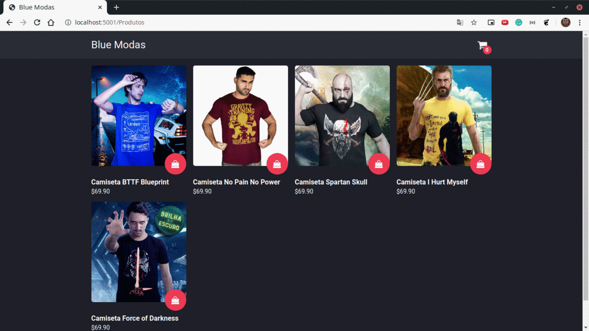

<h1 align="center">
  E-commerce loja Blue Modas
</h1>

  <a href="#rocket-projeto">Projeto</a>&nbsp;&nbsp;&nbsp;|&nbsp;&nbsp;&nbsp;
  <a href="#computer-tecnologias">Tecnologias</a>&nbsp;&nbsp;&nbsp;|&nbsp;&nbsp;&nbsp;
  <a href="#memo-licença">Licença</a>

## :rocket: Projeto

:credit_card: E-commerce loja Blue Modas.

  

### Casos de uso

- [ ] A loja precisa ter uma página principal com a listagem dos produtos com as informações de
preço nome e imagem.

- [ ] Cada produto deve possuir um botão que permitirá adicionar o produto na cesta de compras
da loja.

- [ ] A cesta de compras deve listar todos os produtos escolhidos e seus respectivos preços.

- [ ] Não esqueça de permitir que o cliente altere a quantidade dos produtos que deseje comprar.

- [ ] A página de cesta de compras precisa permitir o cliente finalizar o pedido através do botão
“Finalizar Compra”.

- [ ] Ao finalizar a compra o cliente deve ser direcionado para a página de identificação do cliente
solicitando nome, e-mail e telefone.

- [ ] Após a identificação do cliente deve ser exibido a página do pedido com o número do pedido,
dados do cliente e produtos selecionados com seus respectivos valores.

## :computer: Tecnologias

- .NET Core
- ASP.NET Core MVC
- AutoMapper
- C#
- Entity Framework Core
- JQuery
- JQuery Validation
- JQuery Validation Unobtrusive
- MySQL
- Newtonsoft
- Razor
- Swashbuckle

## :thinking: Como utilizar

## :notebook: Notas

## :memo: Licença

Esse projeto está sob a licença GNU. Veja o arquivo [LICENSE](LICENSE) para mais detalhes.
