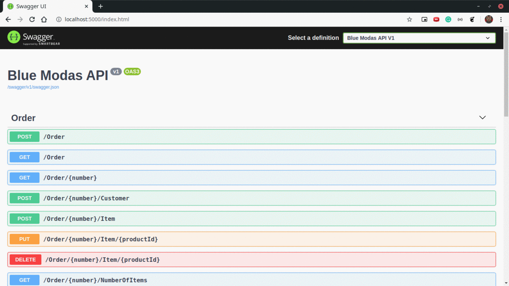

<h1 align="center">
  E-commerce loja Blue Modas
</h1>

<p align="center">
  <a href="#rocket-projeto">Projeto</a>&nbsp;&nbsp;&nbsp;|&nbsp;&nbsp;&nbsp;
  <a href="#computer-tecnologias">Tecnologias</a>&nbsp;&nbsp;&nbsp;|&nbsp;&nbsp;&nbsp;
  <a href="#memo-licença">Licença</a>
</p>

## :rocket: Projeto

:credit_card: E-commerce loja Blue Modas.

### WEB

<p align="center">
  
</p>

### API

<p align="center">
  
</p>

### Casos de Uso

- [ ] A loja precisa ter uma página principal com a listagem dos produtos com as informações de
preço nome e imagem.

- [ ] Cada produto deve possuir um botão que permitirá adicionar o produto na cesta de compras
da loja.

- [ ] A cesta de compras deve listar todos os produtos escolhidos e seus respectivos preços.

- [ ] Não esqueça de permitir que o cliente altere a quantidade dos produtos que deseje comprar.

- [ ] A página de cesta de compras precisa permitir o cliente finalizar o pedido através do botão
“Finalizar Compra”.

- [ ] Ao finalizar a compra o cliente deve ser direcionado para a página de identificação do cliente
solicitando nome, e-mail e telefone.

- [ ] Após a identificação do cliente deve ser exibido a página do pedido com o número do pedido,
dados do cliente e produtos selecionados com seus respectivos valores.

## :computer: Tecnologias

- .NET Core
- ASP.NET Core MVC
- AutoMapper
- C#
- CSS
- Entity Framework Core
- HTML
- JavaScript
- JQuery
- JQuery Validation
- JQuery Validation Unobtrusive
- MySQL
- Newtonsoft
- Razor
- Swashbuckle

## :thinking: Como utilizar

### Requisitos

- .NET Core 3.1
- Git
- MySQL 5

### API 

```bash
$ git clone https://github.com/flaviogf/blue_modas.git

$ cd blue_modas

$ dotnet restore

$ dotnet run --project BlueModas.Api

# Estará rodando na porta 5000
```

### WEB
```bash
$ git clone https://github.com/flaviogf/blue_modas.git

$ cd blue_modas

$ dotnet restore

$ dotnet run --project BlueModas.Web

# Estará rodando na porta 5001
```

## :notebook: Notas

### Escolha do modelo de desenvolvimento

O projeto foi desenvolvido utilizando o modelo Data Driven, esta decisão foi feita com base nos casos de uso, chegando a
conclusão que a complexidade não justificaria o uso do modelo Domain Driven.

### Escolha do banco de dados

O MySQL foi escolhido por estar disponível gratuitamente no serviço em que este projeto está hospedado, no caso o Azure
Web Apps, que também possui um plano gratuito para fins de testes.

Obs: este plano disponibiliza apenas 60 minutos de uso por dia, por isso o link pode estar indisponível algumas vezes.

## :memo: Licença

Esse projeto está sob a licença GNU. Veja o arquivo [LICENSE](LICENSE) para mais detalhes.
